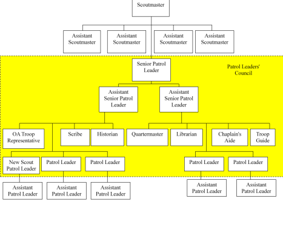

# Troop Organization

It is important to know that the Boy Scouts of America does not operate troops directly. Instead, the BSA grants charters to organizations authorizing them to organize the Scout troop as a part of their youth service programs. BSA National Council in Irving, Texas and our own Northeast Georgia Council in Jefferson will always refer issues back to the local unit and chartered organization to be handled.

Our chartered organization is The Church of the Good Shepherd; 3740 Holtzclaw Road, Cumming, Georgia 30041. The Catholic Church has been our chartered organization since our inception.

The chartered organization appoints a chartered organization representative (COR) – a type of liaison – to serves as a member of the troop committee.

The troop committee is a group of adults that serve in making policy decisions and providing support for the troop. They do not run the troop, but are responsible for overall policy decisions, safekeeping of the finances, as well as selecting adult leaders such as the Scoutmaster (SM) and assistant Scoutmasters (ASM), of the troop. The committee is made up of at least a committee chairperson, advancement chairman, and treasurer and may also include such positions as secretary, fundraising program, and so forth.

The scouts are organized into groups called patrols. Each patrol elects a patrol leader (PL) and assistant patrol leader (APL) and selects a name, flag, and yell. The troop also elects a senior patrol leader (SPL) and assistant senior patrol leaders (ASPLs). Scouts usually volunteer for other leadership positions such as: scribe, quartermaster, chaplain aide, librarian, historian, troop guide, instructors, and Order of the Arrow representative. Junior Assistant Scoutmasters (JASM) are appointed from time to time by the Scoutmaster. Elections for youth leadership positions are held twice a year. The duty positions are a critical element in a scout-led troop and demand that the youth holding a particular position carry out the details of the job description. This not only helps to develop the youth but contributes to the smooth  running of the troop. Job descriptions can be found in the Scouts BSA Handbook.

The patrol leaders' council (PLC) consists of the SPL, ASPLs, all patrol leaders, scribe, quartermaster, chaplain aide, librarian, historian, troop guide, instructors, Order of the Arrow representative, and junior assistant Scoutmaster. Other members may sit on the PLC as designated by the SPL or Scoutmaster. The PLC sets the calendar, selects the events, weekly meetings and is responsible for the overall running of the troop. They set the rules and guidelines, but must do so within the framework of national and local policy.

The Scoutmaster and assistant Scoutmasters act as advisors to the PLC. The Scoutmaster has a super majority veto power vote of one, which is utilized only for the benefit of the entire troop. Typically the troop will look like [Figure 1](#figure-1), but at certain times depending upon the desires of the Scouts, size of the troop, etc. multiple positions may be necessary.

{id="figure-1"}

